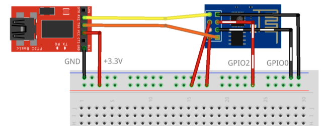

### ESP01 - Flash mode

De ESP-01 heeft geen flash/reset "knopje" en vereist dat `GPIO0` naar `GND` gepulled 
wordt en `GPIO2` high naar 3.3v om in flash mode te komen. Er zijn hier meerdere 
wegen naar Rome mogelijk. 

Het makkelijkst kan dit met een ESP programmer. Deze zijn goedkoop verkrijgbaar, 
maar vereisen mogelijk modificaties voor de ESP01. 
[Hier](https://willem.aandewiel.nl/index.php/2018/08/27/eenvoudige-programmer-voor-de-esp-01-esp8266/) 
vind je een beschrijving hoe je zelf zo'n *programmer* kunt maken.

Heb je een breadboard en een FTDI serial USB adapter voor handen, dan kun je daarmee zelf 
ook een programmer mee maken door het op de volgende manier aansluiten van deze onderdelen.

|van|naar|
|---|---|
|FTDI GND|Breadboard -|
|FTDI +3.3v|Breadboard +|
|FTDI TX| ESP01 RX|
|FTDI RX| ESP01 TX|
|ESP01 GPIO2|Breadboard +|
|ESP01 GPIO0|Breadboard -|
|ESP01 GND|Breadboard -|
|ESP01 3v3|Breadboard +|
|ESP01 RST|Breadboard +|
[bron](https://medium.com/@aallan/getting-started-with-the-esp8266-270e30feb4d1)

   

Sluit de FTDI adapter nu aan je computer, zodra deze power heeft, staat de ESP01 in bootloader mode.

